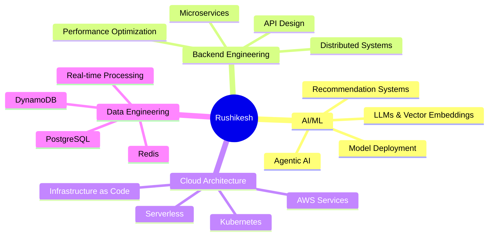

<div align="center">

# Hi there, I'm Rushikesh Joshi 👋

### Software Engineer III @ SAP Concur | AI/ML Specialist | Building Production ML Systems

[](https://reeshi.ai)
[](https://linkedin.com/in/reeshijoshi)
[](mailto:im@reeshi.ai)
[](https://twitter.com/reeshijoshi)

</div>

---

## 🚀 About Me

I'm a Senior Software Engineer with **7+ years of experience** building scalable, production-grade systems with a focus on **AI/ML and distributed systems**. Currently at SAP Concur, I architect and deploy machine learning solutions that serve millions of users globally.

```typescript
const rushikesh = {
  location: "Vancouver, BC, Canada",
  currentRole: "Software Engineer III @ SAP Concur",
  focus: ["AI/ML", "Distributed Systems", "Backend Engineering"],
  education: {
    masters: "Computer Sciences - Data Sciences (First Class with Distinction)",
    bachelors: "Computer Engineering (First Class with Distinction)"
  },
  openTo: ["Consulting", "Full-time Opportunities", "Technical Writing"],
  status: "🟢 Available for select projects"
};
```

---

## 💼 Professional Highlights

### SAP Concur (2023 - Present)
- 🎯 Built **ML recommendation engines** achieving **60% hotel accuracy** and **50% flight accuracy**
- 🤖 Architected **agentic AI solutions** for enterprise travel management
- 📊 Deployed production-grade systems handling millions of predictions daily

### SAP Labs (2021-2023, 2017-2019)
- ⚡ Re-engineered SAP Analytics Cloud with **200-500% performance improvements**
- 🏗️ Led microservices architecture migration
- 📈 Optimized query engines for large-scale data processing

### Susquehanna International Group (2020-2021)
- 💹 Built stock exchange simulator for trading systems
- 💰 **Reduced testing costs by 50%** through automated simulation
- ⚙️ Designed high-performance matching engines

---

## 🛠️ Tech Stack

### AI/ML & Data


### Backend & Languages


### Cloud & Infrastructure


### Databases


### Tools & Practices


---

## 📈 GitHub Stats

<div align="center">


</div>

---

## 🔭 Currently Working On

- 🧠 **Production ML Systems** - Scaling recommendation engines at SAP Concur
- 🤖 **Agentic AI Solutions** - Building autonomous AI agents for enterprise workflows
- ✍️ **Technical Writing** - Sharing insights on AI/ML, Go, and distributed systems at [reeshi.ai/blog](https://reeshi.ai/blog)
- 🔬 **ML Research** - Exploring novel approaches to recommendation systems and vector search

---

## 🌱 Currently Learning

- 🦀 **Rust** - For high-performance systems programming
- 🔮 **Advanced LLM Architectures** - RAG, fine-tuning, and prompt engineering
- 📊 **MLOps at Scale** - Advanced deployment patterns and monitoring
- 🏗️ **Event-Driven Architecture** - Building resilient distributed systems

---

## 📝 Latest Blog Posts

<!-- BLOG-POST-LIST:START -->
- 🧠 [Building Production-Grade ML Recommendation Systems](https://reeshi.ai/blog)
- 🚀 [Scaling Microservices with Go and Kubernetes](https://reeshi.ai/blog)
- 🤖 [A Deep Dive into Agentic AI Systems](https://reeshi.ai/blog)
- ⚡ [Optimizing Database Performance: Lessons from SAP Analytics Cloud](https://reeshi.ai/blog)
<!-- BLOG-POST-LIST:END -->

➡️ [**Read more articles on reeshi.ai/blog**](https://reeshi.ai/blog)

---

## 🎯 Core Expertise



---

## 🏆 Key Achievements

- 📈 **60% accuracy** in hotel recommendations serving millions of users
- ⚡ **200-500% performance improvement** in SAP Analytics Cloud
- 💰 **50% cost reduction** in trading system testing infrastructure
- 🎓 **First Class with Distinction** in both Master's and Bachelor's degrees
- 🌍 Built systems serving **millions of users globally**

---

## 💡 What I Bring to the Table

- 🎯 **Production ML Experience** - Not just models, but scalable, reliable ML systems
- 🏗️ **Architecture Leadership** - Designing systems that scale and perform
- 📊 **Data-Driven Decision Making** - A/B testing, metrics, and continuous improvement
- 🤝 **Cross-Functional Collaboration** - Working across teams to deliver business value
- 📚 **Continuous Learning** - Staying current with the latest in AI/ML and software engineering

---

## 📫 Let's Connect!

I'm always interested in discussing:
- 🤖 AI/ML applications in production
- 🏗️ Distributed systems architecture
- 🚀 Performance optimization challenges
- 💼 Consulting opportunities
- 🎯 Full-time roles in AI/ML engineering

<div align="center">

### 🌟 Interested in working together?

[](https://reeshi.ai)

**Or reach out directly:**

[](mailto:im@reeshi.ai)
[](https://linkedin.com/in/reeshijoshi)

</div>

---

<div align="center">

### 💭 "Building the future, one algorithm at a time."


</div>
